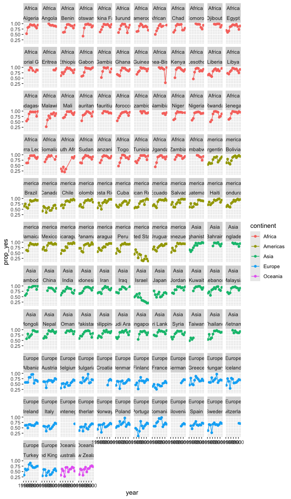

<!-- README.md is generated from README.Rmd. Please edit that file -->

# visualjoin

<!-- badges: start -->
<!-- badges: end -->

The goal of visualjoin is to …

Sometimes joins feel awkward because you need to know what variables are
in the constituent data frames in order to coordinate a good join. But
if you are in a pipeline already, then these dataframes aren’t printed
for you. Below, we just get an error - oh no! (unless there is a natural
join that can happen - common variables)

``` r
library(tidyverse)
#> ── Attaching core tidyverse packages ──────────────────────── tidyverse 2.0.0 ──
#> ✔ dplyr     1.1.4          ✔ readr     2.1.5     
#> ✔ forcats   1.0.0          ✔ stringr   1.5.1     
#> ✔ ggplot2   3.5.1.9000     ✔ tibble    3.2.1     
#> ✔ lubridate 1.9.3          ✔ tidyr     1.3.1     
#> ✔ purrr     1.0.2          
#> ── Conflicts ────────────────────────────────────────── tidyverse_conflicts() ──
#> ✖ dplyr::filter() masks stats::filter()
#> ✖ dplyr::lag()    masks stats::lag()
#> ℹ Use the conflicted package (<http://conflicted.r-lib.org/>) to force all conflicts to become errors
```

``` r

unvotes::un_votes |>
  left_join(y = rnaturalearth::countries110)
#> Error in `left_join()`:
#> ! `by` must be supplied when `x` and `y` have no common variables.
#> ℹ Use `cross_join()` to perform a cross-join.
```

Vizjoin will, allow you to *not* have everything declared at once, but
will show you helpful dataframe summaries as you define your join

``` r
unvotes::un_votes |>
  viz_left_join()
# returns x data frame variables (glimpse-like)


unvotes::un_votes |>
  viz_left_join(y = rnaturalearth::countries110)
# returns x and y data frame variables (glimpse-like) if no natural join happens
```

------------------------------------------------------------------------

# first we want to have a function that is kind of like glimpse, only returns a tibble…

``` r
data_to_df_summary <- function(data = unvotes::un_votes,
  num_values = 4,
  num_columns = ncol(data),
  max_char = 10){
  
data |>
  slice(1:num_values) |>
  mutate(across(everything(), as.character)) |>
  pivot_longer(col = 1:num_columns) |>
  group_by(name) |>
  summarise(values = paste(value, collapse = ", ")) |>
  # mutate(values = str_extract(values))
  mutate(row_number = row_number()) |>
  select(row_number, everything())
  
}

data_to_df_summary()
#> Warning: Using an external vector in selections was deprecated in tidyselect 1.1.0.
#> ℹ Please use `all_of()` or `any_of()` instead.
#>   # Was:
#>   data %>% select(num_columns)
#> 
#>   # Now:
#>   data %>% select(all_of(num_columns))
#> 
#> See <https://tidyselect.r-lib.org/reference/faq-external-vector.html>.
#> This warning is displayed once every 8 hours.
#> Call `lifecycle::last_lifecycle_warnings()` to see where this warning was
#> generated.
#> # A tibble: 4 × 3
#>   row_number name         values                            
#>        <int> <chr>        <chr>                             
#> 1          1 country      United States, Canada, Cuba, Haiti
#> 2          2 country_code US, CA, CU, HT                    
#> 3          3 rcid         3, 3, 3, 3                        
#> 4          4 vote         yes, no, yes, yes
```

# Then, slightly modifying, we’ll have it return different column names depending on if it is right or left side dataframe.

``` r
x_data_to_df_summary <- function(data = unvotes::un_votes,
                                 num_values = 4){
  
  data |> 
    data_to_df_summary() |>
    rename(x_vars = name,
           x_values = values) 
  
  
}

x_data_to_df_summary()
#> # A tibble: 4 × 3
#>   row_number x_vars       x_values                          
#>        <int> <chr>        <chr>                             
#> 1          1 country      United States, Canada, Cuba, Haiti
#> 2          2 country_code US, CA, CU, HT                    
#> 3          3 rcid         3, 3, 3, 3                        
#> 4          4 vote         yes, no, yes, yes
```

``` r
y_data_to_df_summary <- function(
    data = unvotes::un_votes,
    num_values = 4){
  
  data |> 
    data_to_df_summary() |>
    rename(y_vars = name,
           y_values = values) 
  
  
}


y_data_to_df_summary()
#> # A tibble: 4 × 3
#>   row_number y_vars       y_values                          
#>        <int> <chr>        <chr>                             
#> 1          1 country      United States, Canada, Cuba, Haiti
#> 2          2 country_code US, CA, CU, HT                    
#> 3          3 rcid         3, 3, 3, 3                        
#> 4          4 vote         yes, no, yes, yes
```

``` r

rnaturalearth::countries110 |>
  sf::st_drop_geometry() |>
  y_data_to_df_summary()
#> # A tibble: 168 × 3
#>    row_number y_vars     y_values                  
#>         <int> <chr>      <chr>                     
#>  1          1 ABBREV     Fiji, Tanz., W. Sah., Can.
#>  2          2 ABBREV_LEN 4, 5, 7, 4                
#>  3          3 ADM0_A3    FJI, TZA, SAH, CAN        
#>  4          4 ADM0_A3_AR FJI, TZA, SAH, CAN        
#>  5          5 ADM0_A3_BD FJI, TZA, SAH, CAN        
#>  6          6 ADM0_A3_BR FJI, TZA, SAH, CAN        
#>  7          7 ADM0_A3_CN FJI, TZA, SAH, CAN        
#>  8          8 ADM0_A3_DE FJI, TZA, SAH, CAN        
#>  9          9 ADM0_A3_EG FJI, TZA, SAH, CAN        
#> 10         10 ADM0_A3_ES FJI, TZA, SAH, CAN        
#> # ℹ 158 more rows
```

``` r

viz_left_join <- function(x, y = NULL, by = NULL, natural_join = F, ...){
  
  if(is_null(y)){out <- x_data_to_df_summary(x)}
  
  if(is_null(by)&!is.null(y)&!natural_join){
    
    out <- full_join(x_data_to_df_summary(x),
              y_data_to_df_summary(y)) |>
      select(-row_number)
   
    message("add 'by' in this form:  `by = join_by(x_var_name == y_var_name)`")
     
  }
  
  if(!is_null(by)&!is.null(y)){
  
  out <- left_join(x, y, by, ...)
    
  }
  
  if(natural_join){
    
  out <- left_join(x, y, ...)
    
  }
  
  out
  
}
```

# And now the traditional readme

## You can look at your x data summary

``` r
unvotes::un_votes %>% 
  viz_left_join()
#> # A tibble: 4 × 3
#>   row_number x_vars       x_values                          
#>        <int> <chr>        <chr>                             
#> 1          1 country      United States, Canada, Cuba, Haiti
#> 2          2 country_code US, CA, CU, HT                    
#> 3          3 rcid         3, 3, 3, 3                        
#> 4          4 vote         yes, no, yes, yes
```

## … and then along y data summary

``` r
unvotes::un_votes %>% 
  viz_left_join(y = gapminder::gapminder)
#> Joining with `by = join_by(row_number)`
#> add 'by' in this form: `by = join_by(x_var_name == y_var_name)`
#> # A tibble: 6 × 4
#>   x_vars       x_values                           y_vars    y_values            
#>   <chr>        <chr>                              <chr>     <chr>               
#> 1 country      United States, Canada, Cuba, Haiti continent Asia, Asia, Asia, A…
#> 2 country_code US, CA, CU, HT                     country   Afghanistan, Afghan…
#> 3 rcid         3, 3, 3, 3                         gdpPercap 779.4453145, 820.85…
#> 4 vote         yes, no, yes, yes                  lifeExp   28.801, 30.332, 31.…
#> 5 <NA>         <NA>                               pop       8425333, 9240934, 1…
#> 6 <NA>         <NA>                               year      1952, 1957, 1962, 1…
```

## and performing the join (not very interesting - need a better example!)

``` r
unvotes::un_votes %>% 
  viz_left_join(y = gapminder::gapminder,
                by = join_by(country == country))
#> Warning in left_join(x, y, by, ...): Detected an unexpected many-to-many relationship between `x` and `y`.
#> ℹ Row 1 of `x` matches multiple rows in `y`.
#> ℹ Row 1609 of `y` matches multiple rows in `x`.
#> ℹ If a many-to-many relationship is expected, set `relationship =
#>   "many-to-many"` to silence this warning.
#> # A tibble: 7,813,610 × 9
#>     rcid country     country_code vote  continent  year lifeExp    pop gdpPercap
#>    <dbl> <chr>       <chr>        <fct> <fct>     <int>   <dbl>  <int>     <dbl>
#>  1     3 United Sta… US           yes   Americas   1952    68.4 1.58e8    13990.
#>  2     3 United Sta… US           yes   Americas   1957    69.5 1.72e8    14847.
#>  3     3 United Sta… US           yes   Americas   1962    70.2 1.87e8    16173.
#>  4     3 United Sta… US           yes   Americas   1967    70.8 1.99e8    19530.
#>  5     3 United Sta… US           yes   Americas   1972    71.3 2.10e8    21806.
#>  6     3 United Sta… US           yes   Americas   1977    73.4 2.20e8    24073.
#>  7     3 United Sta… US           yes   Americas   1982    74.6 2.32e8    25010.
#>  8     3 United Sta… US           yes   Americas   1987    75.0 2.43e8    29884.
#>  9     3 United Sta… US           yes   Americas   1992    76.1 2.57e8    32004.
#> 10     3 United Sta… US           yes   Americas   1997    76.8 2.73e8    35767.
#> # ℹ 7,813,600 more rows
```

## And left_join() arguments are usable.

``` r
unvotes::un_votes %>% 
  viz_left_join(y = gapminder::gapminder,
                by = join_by(country == country), 
                relationship = "many-to-many")
#> # A tibble: 7,813,610 × 9
#>     rcid country     country_code vote  continent  year lifeExp    pop gdpPercap
#>    <dbl> <chr>       <chr>        <fct> <fct>     <int>   <dbl>  <int>     <dbl>
#>  1     3 United Sta… US           yes   Americas   1952    68.4 1.58e8    13990.
#>  2     3 United Sta… US           yes   Americas   1957    69.5 1.72e8    14847.
#>  3     3 United Sta… US           yes   Americas   1962    70.2 1.87e8    16173.
#>  4     3 United Sta… US           yes   Americas   1967    70.8 1.99e8    19530.
#>  5     3 United Sta… US           yes   Americas   1972    71.3 2.10e8    21806.
#>  6     3 United Sta… US           yes   Americas   1977    73.4 2.20e8    24073.
#>  7     3 United Sta… US           yes   Americas   1982    74.6 2.32e8    25010.
#>  8     3 United Sta… US           yes   Americas   1987    75.0 2.43e8    29884.
#>  9     3 United Sta… US           yes   Americas   1992    76.1 2.57e8    32004.
#> 10     3 United Sta… US           yes   Americas   1997    76.8 2.73e8    35767.
#> # ℹ 7,813,600 more rows
```

# And here we do a bit smaller join…

``` r
unvotes::un_votes %>% 
  filter(rcid == 3) %>% 
  viz_left_join(y = gapminder::gapminder %>% 
                  filter(year == min(year)),
                by = join_by(country == country))
#> # A tibble: 51 × 9
#>     rcid country     country_code vote  continent  year lifeExp    pop gdpPercap
#>    <dbl> <chr>       <chr>        <fct> <fct>     <int>   <dbl>  <int>     <dbl>
#>  1     3 United Sta… US           yes   Americas   1952    68.4 1.58e8    13990.
#>  2     3 Canada      CA           no    Americas   1952    68.8 1.48e7    11367.
#>  3     3 Cuba        CU           yes   Americas   1952    59.4 6.01e6     5587.
#>  4     3 Haiti       HT           yes   Americas   1952    37.6 3.20e6     1840.
#>  5     3 Dominican … DO           yes   Americas   1952    45.9 2.49e6     1398.
#>  6     3 Mexico      MX           yes   Americas   1952    50.8 3.01e7     3478.
#>  7     3 Guatemala   GT           yes   Americas   1952    42.0 3.15e6     2428.
#>  8     3 Honduras    HN           yes   Americas   1952    41.9 1.52e6     2195.
#>  9     3 El Salvador SV           yes   Americas   1952    45.3 2.04e6     3048.
#> 10     3 Nicaragua   NI           yes   Americas   1952    42.3 1.17e6     3112.
#> # ℹ 41 more rows
```

# And we can specify that a natural join is allowed.

``` r
unvotes::un_votes |>
  viz_left_join(unvotes::un_roll_calls,
                natural_join = T)
#> Joining with `by = join_by(rcid)`
#> # A tibble: 869,937 × 12
#>     rcid country country_code vote  session importantvote date       unres amend
#>    <dbl> <chr>   <chr>        <fct>   <dbl>         <int> <date>     <chr> <int>
#>  1     3 United… US           yes         1             0 1946-01-01 R/1/…     1
#>  2     3 Canada  CA           no          1             0 1946-01-01 R/1/…     1
#>  3     3 Cuba    CU           yes         1             0 1946-01-01 R/1/…     1
#>  4     3 Haiti   HT           yes         1             0 1946-01-01 R/1/…     1
#>  5     3 Domini… DO           yes         1             0 1946-01-01 R/1/…     1
#>  6     3 Mexico  MX           yes         1             0 1946-01-01 R/1/…     1
#>  7     3 Guatem… GT           yes         1             0 1946-01-01 R/1/…     1
#>  8     3 Hondur… HN           yes         1             0 1946-01-01 R/1/…     1
#>  9     3 El Sal… SV           yes         1             0 1946-01-01 R/1/…     1
#> 10     3 Nicara… NI           yes         1             0 1946-01-01 R/1/…     1
#> # ℹ 869,927 more rows
#> # ℹ 3 more variables: para <int>, short <chr>, descr <chr>
```

# An examples which a couple of joins (unfortunely just some natural joins, so not too exciting)

``` r
unvotes::un_votes |>
  viz_left_join(unvotes::un_roll_calls)
#> Joining with `by = join_by(row_number)`
#> add 'by' in this form: `by = join_by(x_var_name == y_var_name)`
#> # A tibble: 9 × 4
#>   x_vars       x_values                           y_vars        y_values        
#>   <chr>        <chr>                              <chr>         <chr>           
#> 1 country      United States, Canada, Cuba, Haiti amend         "1, 0, 0, 0"    
#> 2 country_code US, CA, CU, HT                     date          "1946-01-01, 19…
#> 3 rcid         3, 3, 3, 3                         descr         "TO ADOPT A CUB…
#> 4 vote         yes, no, yes, yes                  importantvote "0, 0, 0, 0"    
#> 5 <NA>         <NA>                               para          "0, 0, 0, 0"    
#> 6 <NA>         <NA>                               rcid          "3, 4, 5, 6"    
#> 7 <NA>         <NA>                               session       "1, 1, 1, 1"    
#> 8 <NA>         <NA>                               short         "AMENDMENTS, RU…
#> 9 <NA>         <NA>                               unres         "R/1/66, R/1/79…
```

``` r

unvotes::un_votes |>
  viz_left_join(unvotes::un_roll_calls,
                natural_join = T)
#> Joining with `by = join_by(rcid)`
#> # A tibble: 869,937 × 12
#>     rcid country country_code vote  session importantvote date       unres amend
#>    <dbl> <chr>   <chr>        <fct>   <dbl>         <int> <date>     <chr> <int>
#>  1     3 United… US           yes         1             0 1946-01-01 R/1/…     1
#>  2     3 Canada  CA           no          1             0 1946-01-01 R/1/…     1
#>  3     3 Cuba    CU           yes         1             0 1946-01-01 R/1/…     1
#>  4     3 Haiti   HT           yes         1             0 1946-01-01 R/1/…     1
#>  5     3 Domini… DO           yes         1             0 1946-01-01 R/1/…     1
#>  6     3 Mexico  MX           yes         1             0 1946-01-01 R/1/…     1
#>  7     3 Guatem… GT           yes         1             0 1946-01-01 R/1/…     1
#>  8     3 Hondur… HN           yes         1             0 1946-01-01 R/1/…     1
#>  9     3 El Sal… SV           yes         1             0 1946-01-01 R/1/…     1
#> 10     3 Nicara… NI           yes         1             0 1946-01-01 R/1/…     1
#> # ℹ 869,927 more rows
#> # ℹ 3 more variables: para <int>, short <chr>, descr <chr>
```

``` r


unvotes::un_votes |>
  viz_left_join(unvotes::un_roll_calls,
                natural_join = T) %>% 
  mutate(year = year(date)) %>% 
  viz_left_join(gapminder::gapminder)
#> Joining with `by = join_by(rcid)`
#> Joining with `by = join_by(row_number)`
#> add 'by' in this form: `by = join_by(x_var_name == y_var_name)`
#> # A tibble: 13 × 4
#>    x_vars        x_values                                        y_vars y_values
#>    <chr>         <chr>                                           <chr>  <chr>   
#>  1 amend         1, 1, 1, 1                                      conti… Asia, A…
#>  2 country       United States, Canada, Cuba, Haiti              count… Afghani…
#>  3 country_code  US, CA, CU, HT                                  gdpPe… 779.445…
#>  4 date          1946-01-01, 1946-01-01, 1946-01-01, 1946-01-01  lifeE… 28.801,…
#>  5 descr         TO ADOPT A CUBAN AMENDMENT TO THE UK PROPOSAL … pop    8425333…
#>  6 importantvote 0, 0, 0, 0                                      year   1952, 1…
#>  7 para          0, 0, 0, 0                                      <NA>   <NA>    
#>  8 rcid          3, 3, 3, 3                                      <NA>   <NA>    
#>  9 session       1, 1, 1, 1                                      <NA>   <NA>    
#> 10 short         AMENDMENTS, RULES OF PROCEDURE, AMENDMENTS, RU… <NA>   <NA>    
#> 11 unres         R/1/66, R/1/66, R/1/66, R/1/66                  <NA>   <NA>    
#> 12 vote          yes, no, yes, yes                               <NA>   <NA>    
#> 13 year          1946, 1946, 1946, 1946                          <NA>   <NA>
```

``` r


unvotes::un_votes |>
  viz_left_join(unvotes::un_roll_calls,
                natural_join = T) %>% 
  mutate(year = year(date)) %>% 
  viz_left_join(gapminder::gapminder, 
                natural_join = T)
#> Joining with `by = join_by(rcid)`
#> Joining with `by = join_by(country, year)`
#> # A tibble: 869,937 × 17
#>     rcid country country_code vote  session importantvote date       unres amend
#>    <dbl> <chr>   <chr>        <fct>   <dbl>         <int> <date>     <chr> <int>
#>  1     3 United… US           yes         1             0 1946-01-01 R/1/…     1
#>  2     3 Canada  CA           no          1             0 1946-01-01 R/1/…     1
#>  3     3 Cuba    CU           yes         1             0 1946-01-01 R/1/…     1
#>  4     3 Haiti   HT           yes         1             0 1946-01-01 R/1/…     1
#>  5     3 Domini… DO           yes         1             0 1946-01-01 R/1/…     1
#>  6     3 Mexico  MX           yes         1             0 1946-01-01 R/1/…     1
#>  7     3 Guatem… GT           yes         1             0 1946-01-01 R/1/…     1
#>  8     3 Hondur… HN           yes         1             0 1946-01-01 R/1/…     1
#>  9     3 El Sal… SV           yes         1             0 1946-01-01 R/1/…     1
#> 10     3 Nicara… NI           yes         1             0 1946-01-01 R/1/…     1
#> # ℹ 869,927 more rows
#> # ℹ 8 more variables: para <int>, short <chr>, descr <chr>, year <dbl>,
#> #   continent <fct>, lifeExp <dbl>, pop <int>, gdpPercap <dbl>
```

``` r
unvotes::un_votes |>
  viz_left_join(unvotes::un_roll_calls,
                natural_join = T) %>% 
  mutate(year = year(date)) %>% 
  viz_left_join(gapminder::gapminder, 
                natural_join = T) %>% 
  filter(!is.na(continent)) %>% 
  summarise(prop_yes = sum(vote == "yes")/n(), 
            .by = c(year, country, continent)) %>% 
  ggplot() + 
  aes(y = prop_yes, x = year, color = continent) + 
  geom_point() +
  geom_line() + 
  facet_wrap(facets = vars(continent, country))
#> Joining with `by = join_by(rcid)`
#> Joining with `by = join_by(country, year)`
#> `geom_line()`: Each group consists of only one observation. ℹ Do you need to
#> adjust the group aesthetic?
```

<!-- -->
